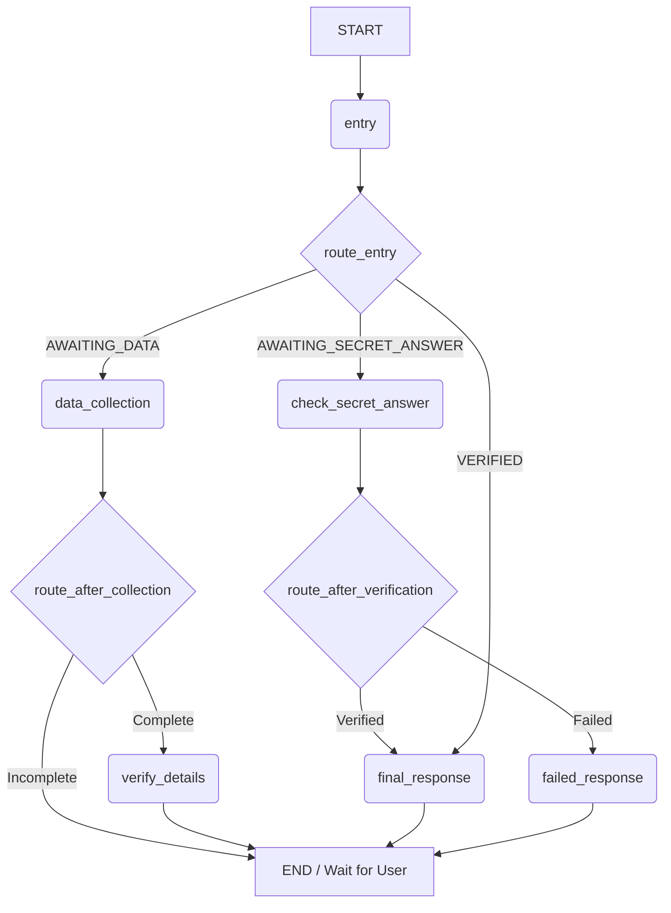

# AI-Powered Customer Support Agent

This project implements a multi-step, stateful conversational AI agent using LangGraph. The agent's primary mission is to securely verify a customer's identity through a multi-turn dialogue before routing them to the appropriate level of support. This README provides a detailed overview of the system's architecture, state management, and conversational flow.

## Core Concepts: State and Memory

The entire system is built around a central state machine managed by LangGraph. The state is a Python dictionary that acts as the agent's short-term memory for the entire conversation.

## State Management

The `GraphState` object is the single source of truth for the conversation. It holds all the information collected and the current status of the verification process.


class GraphState(TypedDict):
    messages: Annotated[List[BaseMessage], operator.add]
    user_name: Optional[str]
    user_iban: Optional[str]
    user_phone: Optional[str]
    secret_answer: Optional[str]
    is_premium: bool
    data_collection_is_complete: bool
    verification_status: str
```

- **messages**: This list is the core of the agent's memory. Every user input (`HumanMessage`) and AI response (`AIMessage`) is appended to this list, providing the full conversational context for each step.
- **verification_status**: This string acts as a “bookmark,” telling the graph which stage of the process the user is in (e.g., `"AWAITING_DATA"`, `"AWAITING_SECRET_ANSWER"`, `"VERIFIED"`). The graph's entry router checks this status on every turn to decide which node to run next.

## Agent Architecture

The system is composed of several "agents" (represented by nodes in the graph) that work together as a team. Some agents are powered by LLMs for natural language tasks, while others are simple Python functions for reliable, deterministic logic.

### Agent 1: The Greeter (`data_collection_node`)
- **Role**: This is the friendly, customer-facing agent.
- **Implementation**: It uses an LLM to parse the user's messages, intelligently extract their name, IBAN, and phone number, and ask for any missing information.
- **Output**: It updates the state with the collected details and sets the `data_collection_is_complete` flag to `true` when it has all the required information.

### Agent 2: The Bouncer (2a- `verify_details_node` & `2b- check_secret_answer_node`)
- **Role**: This agent acts as the security checkpoint. It is split into two deterministic (non-LLM) nodes for maximum reliability.
- **Implementation**:
  - The `2a- verify_details_node` first checks if the user exists in the database. If so, it enforces the 2-out-of-3 matching rule for the provided details. Upon success, it retrieves the user's secret question and asks it.
  - The `2b- check_secret_answer_node` takes the user's next response and compares it to the correct answer stored in the state.
- **Output**: It updates the `verification_status` to `"VERIFIED"` or `"FAILED"`.

### Agent 3: The Specialist (`final_response_node`)
- **Role**: This is the final support agent that engages with the user after they have been successfully verified.
- **Implementation**: It first checks the `is_premium` flag in the state. Based on this, it uses a specialized, LLM-powered prompt to generate a tailored response for either a premium or a regular client, providing the correct support phone number for each.

## Graph Flow and Logic

The flow of the conversation is controlled by a series of conditional edges that use router functions to check the `verification_status` at each critical step.



**Entry Point**: The graph always begins at a simple entry node, which immediately transitions to the `route_entry` router.

**Main Routing**: The `route_entry` function checks the `verification_status` on every turn:
- If the user is `"VERIFIED"`, it sends them directly to the `final_response` agent.
- If the user is `"AWAITING_SECRET_ANSWER"`, it sends them directly to the `check_secret_answer` node.
- Otherwise, it sends them to the `data_collection` node.

**Data Collection Routing**: After the `data_collection` node runs, the `route_after_collection` router checks if all details have been gathered. If yes, it proceeds to `verify_details`. If not, the graph ends its turn to wait for the user's next message.

**Final Verification Routing**: After the `check_secret_answer` node runs, the `route_after_verification` router checks the final status and sends the user to either the `final_response` (on success) or `failed_response` (on failure).

This stateful, multi-step process ensures a secure and logical conversational flow, fulfilling all the business requirements of the challenge.
